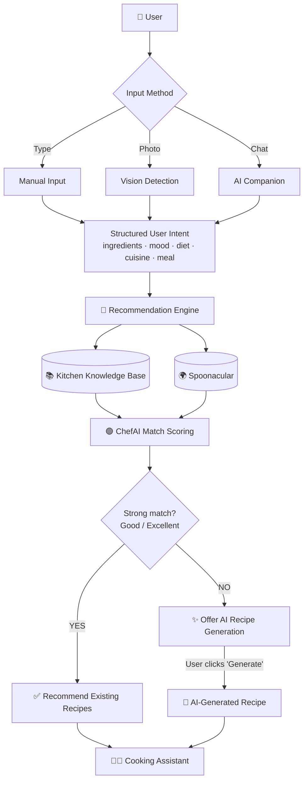

# ChefAI 🍳
### An AI-Powered Intelligent Kitchen Assistant

> *An AI-powered intelligent kitchen assistant that recommends the best meals you can cook using ingredients already available in your kitchen — and only generates a brand-new recipe with AI when nothing else fits.*

[](https://chef-ai-seven-livid.vercel.app)
[](https://github.com/24jainnikita/ChefAI)


---

## 🧠 What is ChefAI?

You open your fridge — **paneer, onions, tomatoes** — and have no idea what to cook. Most recipe apps make you start from a dish you already have in mind. **ChefAI works the other way around.**

ChefAI takes the ingredients you *already have*, understands your mood and preferences, and **recommends the best real recipes you can cook right now** — with a transparent score explaining *why* each one was chosen. Only when nothing scores well does it offer to **generate a fresh recipe with AI**.

It is **not** "just an AI recipe generator." It is a **recommendation-first kitchen assistant** where AI is the final safety net, not the engine.

| | |
|---|---|
| 🥕 **Reduce food waste** | Cook with what's already in your kitchen |
| 🎯 **Intelligent recommendations** | A real scoring engine, not random results |
| 🔍 **Explainable** | Every recipe shows a *ChefAI Match %* and *why* |
| 🤖 **AI-assisted** | Vision, conversation, and custom recipes — only where they add value |
| 🧑‍🍳 **Personalized** | Mood, diet, cuisine, meal type, servings, substitutions |

---

## ✨ Features

### Recommendation & Knowledge
- 🧮 **Hybrid Recommendation Engine** — weighted scoring across ingredient match, mood, cuisine, meal type & prep time
- 📚 **Local Kitchen Knowledge Base** — 100+ curated recipes (Indian + everyday fusion: sandwiches, wraps, pasta, indo-chinese, quick meals)
- 🌍 **Spoonacular integration** — supplements local results for global recipes
- 🟢 **Explainable Recommendations (ChefAI Match)** — % score, match level, progress bar
- 💬 **"Why this recipe?" reasoning** — only true, human-friendly explanations
- 🧂 **Ingredient normalization** — *capsicum / bell pepper / shimla mirch* all resolve to one canonical name

### AI Layer (used intelligently)
- ✨ **AI-Generated Custom Recipes** — final fallback only, on explicit user request
- 🤖 **AI Kitchen Companion (Chef Mimi)** — a friendly mascot chat assistant
- 🗣️ **Natural-language ingredient extraction** — *"I have paneer and tomatoes, something quick"*
- 👩‍🍳 **Cooking Assistant Mode** — substitutions, scaling, steps, storage, reheating, side dishes for the selected recipe

### Vision
- 📷 **Vision-based ingredient detection** — snap or upload a photo of your ingredients
- 📸 **Native camera capture** — rear camera on mobile, webcam on desktop
- 🖼️ **Image upload** — with client-side compression
- 🔢 **Ingredient quantity detection** — editable before searching

### Kitchen & Personalization
- 🗄️ **Pantry management** — rich categories + cloud-saved pantry
- 😌 **Mood-aware recommendations** — lazy, festive, healthy, comfort, fancy, snack
- 🇮🇳 **Cuisine, meal type & dietary filters** — veg / vegan / non-veg
- 🛒 **Shopping list generator** — see what you're missing
- 📅 **Weekly meal planner**
- 🔢 **Serving-size scaling** — 1–30 servings, auto-adjusted quantities
- 🔁 **Ingredient substitutions** — static DB + contextual AI suggestions
- 🔥 **Nutrition insights** — calories & macros per serving

### Platform
- 🔐 **Firebase Authentication** — Google sign-in
- ☁️ **Firestore cloud favourites & pantry** — synced across devices
- 📱 **Responsive design** — mobile, tablet & desktop

---

## 🏗️ Architecture

ChefAI's defining feature is that **recommendation comes first** and **AI is the last resort**.



**Plain-text view:**

```
User → (Manual / Vision / AI Companion)
     → Structured User Intent
     → Recommendation Engine → Kitchen Knowledge Base + Spoonacular
     → ChefAI Match
     → High match? ── YES → Existing Recipe → Cooking Assistant
                    └─ NO  → Offer AI Generation → AI Recipe → Cooking Assistant
```

---

## 🤔 Why This Architecture?

ChefAI deliberately does **not** route every request through an LLM. The recommendation engine leads; AI assists. This is a conscious engineering decision:

| Benefit | How ChefAI achieves it |
|---|---|
| ⚡ **Speed** | The scoring engine runs locally in plain JS — results are instant, no model latency |
| 🛡️ **Reliability** | Curated recipes are consistent and accurate; no hallucinated steps or quantities |
| 💸 **Lower API usage** | Most searches never call any AI; the local DB does the work |
| 🪂 **Graceful degradation** | If Gemini is down or rate-limited, recommendations still work perfectly |
| 🔋 **Works at zero quota** | Even with **no AI keys**, ChefAI fully recommends, scores, and explains |
| 🎯 **Recommendation-first** | AI is the *final fallback*, not the primary source — better UX and lower cost |

> **In short:** ChefAI is smart because of *better data and better scoring*, not just *more AI*.

---

## 🛠️ Tech Stack

| Layer | Technology |
|---|---|
| **Frontend** | HTML5, CSS3, Vanilla JavaScript (no framework, no build step) |
| **Recommendation Engine** | Custom weighted scoring engine (pure JavaScript) ⭐ core tech |
| **Local Knowledge Base** | Curated JSON recipe database + ingredient normalization layer |
| **Backend** | Node.js |
| **Serverless** | Vercel Serverless Functions |
| **LLM (assist)** | Google Gemini API (`gemini-2.0-flash`) |
| **Vision** | Google Gemini Vision (multimodal) |
| **Global recipes** | Spoonacular API |
| **Auth** | Firebase Authentication (Google) |
| **Database** | Cloud Firestore (favourites & pantry) |
| **Hosting** | Vercel |
| **Version Control** | GitHub |

---

## 📁 Project Structure

```
chefai/
├── api/                          ← Vercel serverless functions (endpoints)
│   ├── recipes.js                ← recommendation search (primary)
│   ├── generate.js               ← AI custom recipe (final fallback)
│   ├── vision.js                 ← image → ingredient detection
│   ├── understand.js             ← natural language → structured intent
│   └── _lib/                     ← shared backend logic
│       ├── recommender.js        ← ⭐ scoring engine (hard filters + weighted score)
│       ├── recipeEngine.js       ← orchestration (sources, merge, dedupe)
│       ├── localDb.js            ← local knowledge base loader + normalization
│       ├── spoonacular.js        ← Spoonacular service
│       ├── matching.js           ← shared ingredient matching helpers
│       ├── normalize.js          ← ingredient normalization layer
│       ├── substitutions.js      ← static substitution database
│       ├── cache.js              ← in-memory TTL cache
│       ├── config.js             ← maps, staples, constants
│       ├── formatter.js          ← response shaping
│       ├── http.js               ← fetch w/ timeout + retry
│       ├── reasoningEngine.js    ← provider-agnostic reasoning interface
│       ├── visionService.js      ← provider-agnostic vision interface
│       ├── nluService.js         ← provider-agnostic NLU interface
│       └── providers/            ← swappable LLM providers
│           ├── gemini.js         ← reasoning / enhancement
│           ├── geminiVision.js   ← vision ingredient detection
│           ├── geminiNlu.js      ← language understanding
│           └── geminiRecipe.js   ← custom recipe generation
├── data/                         ← the Kitchen Knowledge Base
│   ├── indian-recipes.json       ← 100+ curated recipes (rich metadata)
│   ├── ingredient-aliases.json   ← synonym → canonical map
│   └── substitutions.json        ← common ingredient swaps
├── js/                           ← frontend
│   ├── app.js                    ← UI, search, cards, modal, ChefAI Match, vision UI
│   ├── chef.js                   ← AI Companion + conversation intelligence + cooking mode
│   ├── api.js                    ← frontend API client
│   └── firebase.js               ← auth, favourites & pantry sync
├── css/
│   └── style.css
├── images/
│   ├── logo.jpeg
│   └── recipes/                  ← recipe images (kebab-case filenames)
├── screenshots/
├── index.html
├── vercel.json
└── package.json
```

---

## 🌟 Feature Highlights

### 🧮 Hybrid Recommendation Engine
The heart of ChefAI. It applies **hard filters** (diet, cuisine, meal type) then a **weighted soft score**:

| Factor | Weight |
|---|---|
| Ingredient match | 40% |
| Mood | 25% |
| Cuisine | 15% |
| Meal type | 10% |
| Prep time | 10% |

If strict filtering finds nothing, it **progressively relaxes** soft constraints so it **never returns zero** results.

### 🟢 Explainable Recommendations (ChefAI Match)
Every recipe shows a **match percentage**, a **level** (🟢 Excellent / 🟡 Good / 🟠 Partial / ⚪ Weak), a **progress bar**, and plain-language reasons like *"Uses all your ingredients"* and *"Ready in just 18 minutes"* — derived entirely from engine output, never invented.

### 📚 Kitchen Knowledge Base
100+ curated recipes with rich metadata (ingredients & quantities, nutrition, difficulty, moods, tags, pantry items, substitutions) plus an **ingredient normalization layer** so synonyms never cause missed matches.

### 👁️ Vision-Based Ingredient Recognition
Upload or **capture a live photo** of your ingredients. Gemini Vision returns a structured, **editable** ingredient list (with quantities) that flows into the *same* recommendation pipeline.

### 🤖 AI Companion (Chef Mimi)
An animated mascot chat assistant that understands **natural language** (*"I have rice and egg, something quick"*), auto-fills filters, and triggers a search — with a built-in local parser so it works even when AI is unavailable.

### 👩‍🍳 Cooking Assistant
Once you open a recipe, the companion switches into cooking mode: substitutions, healthier/vegan versions, serving scaling, spice tuning, step explanations, storage, reheating and side-dish ideas — all grounded in the selected recipe.

### ✨ AI Custom Recipe Generation
The **final fallback**. When no recipe scores well, ChefAI offers (never forces) a freshly generated recipe built from *your* ingredients, cached to avoid repeat API calls, and rendered in the same card/modal as every other recipe.

---

## 📸 Screenshots

### ChefAI Overview


| Feature | Preview |
|---|---|
| 🔍 Vision Ingredient Detection | *screenshot coming soon* |
| 🤖 AI Companion (Chef Mimi) | *screenshot coming soon* |
| 🟢 ChefAI Match (Explainable) | *screenshot coming soon* |
| 👩‍🍳 Cooking Assistant | *screenshot coming soon* |
| ✨ AI Recipe Generation | *screenshot coming soon* |

---

## ⚡ Performance

- 🧮 **The Recommendation Engine runs locally** — instant, in-memory scoring, no model round-trip.
- 📚 **Existing recipes require no AI** — the vast majority of searches are fully served by the knowledge base.
- ✨ **AI is only used when necessary** — vision/chat on demand, custom generation only on explicit click.
- 🗃️ **Caching reduces API usage** — both recommendation results and AI-generated recipes are cached, so identical requests don't re-hit the APIs.

---

## 🚀 Run Locally

```bash
# 1. Clone
git clone https://github.com/24jainnikita/ChefAI.git
cd ChefAI

# 2. Install Vercel CLI
npm install -g vercel

# 3. Add environment variables — create .env.local:
#   GEMINI_KEY=your_gemini_key
#   GEMINI_KEY2=your_backup_gemini_key   (optional)
#   SPOONACULAR_KEY=your_spoonacular_key
#   ENABLE_REASONING=true                (optional; set false to save quota in dev)

# 4. Run
vercel dev
```

> 💡 **Zero-key mode:** ChefAI still recommends, scores, and explains recipes even with **no API keys** — only the AI assist features (vision, chat, custom generation) require Gemini.

Get free API keys:
- **Gemini** → [aistudio.google.com](https://aistudio.google.com)
- **Spoonacular** → [spoonacular.com/food-api](https://spoonacular.com/food-api)

### Deploy

```bash
vercel env add GEMINI_KEY        # add keys to the cloud project (all environments)
vercel env add SPOONACULAR_KEY
vercel --prod
```

> 📷 Camera capture requires **HTTPS** — works on the deployed URL and on `localhost`.

---

## 🆚 Why ChefAI vs Static Recipe Apps

| Feature | Static Recipe Apps | **ChefAI** |
|---|---|---|
| Approach | Search a dish you already want | **Cook what you already have** |
| Recommendations | Keyword filtering | **Weighted scoring engine** |
| Explainability | ❌ None | ✅ **ChefAI Match + reasons** |
| Indian + fusion coverage | Limited | ✅ **Curated knowledge base** |
| Zero results possible | ✅ Common | ❌ **Never returns zero** |
| Photo input | ❌ | ✅ **Vision + camera** |
| Conversational | ❌ | ✅ **AI Companion** |
| AI dependency | — | ✅ **Fallback only, works without it** |

---

## 🗺️ Future Improvements

- 🔤 **OCR support** — read printed labels & handwritten lists
- 📦 **Barcode scanning** — instant pantry stocking
- 🎙️ **Voice assistant** — hands-free cooking
- 📊 **Nutrition tracking** — daily/weekly intake history
- 🛒 **Smart grocery suggestions** — predictive shopping lists
- 🌐 **Multi-language support**

---

## 👩‍💻 Author

**Nikita Jain**
[GitHub](https://github.com/24jainnikita) · [LinkedIn](https://linkedin.com/in/24jainnikita)

---

## 🎓 Course Outcomes Addressed

- **CO1** — Real-world problem identification (food waste, meal planning)
- **CO2** — Software design using APIs, serverless & a custom recommendation engine
- **CO3** — Implementation with clean, modular coding practices
- **CO4** — Independent project execution
- **CO5** — Documentation and presentation

---

<p align="center"><em>ChefAI — Cook what you have, not what you wish you had.</em> 🍳</p>
